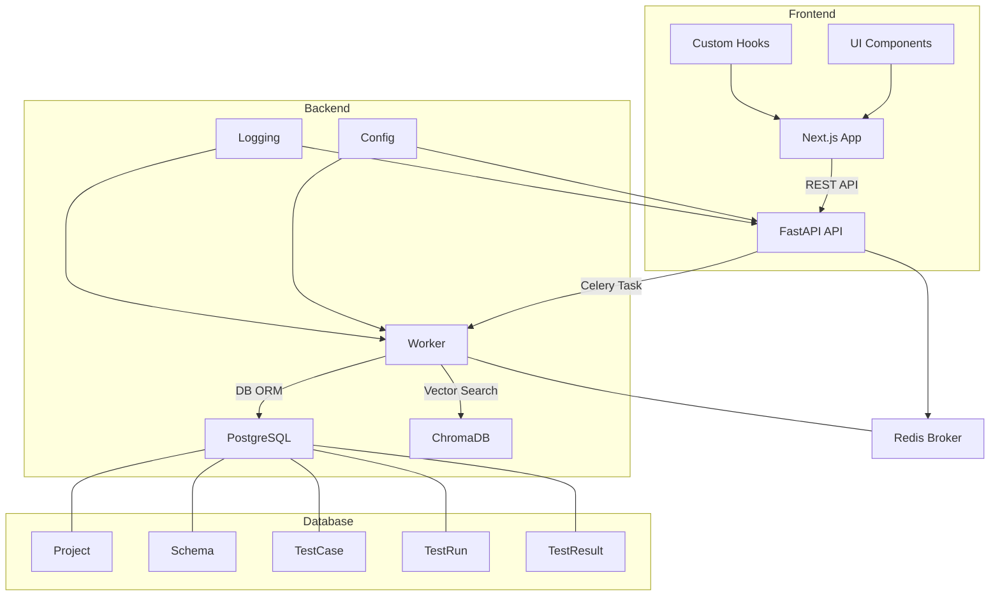
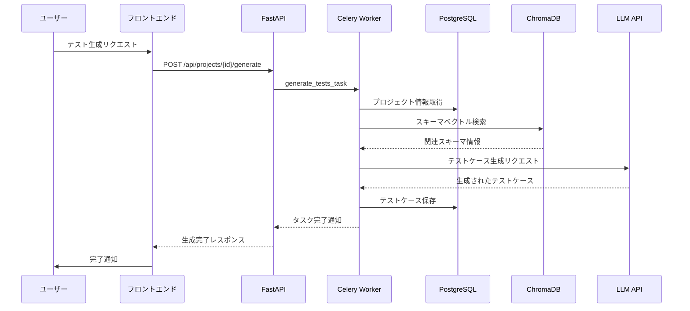
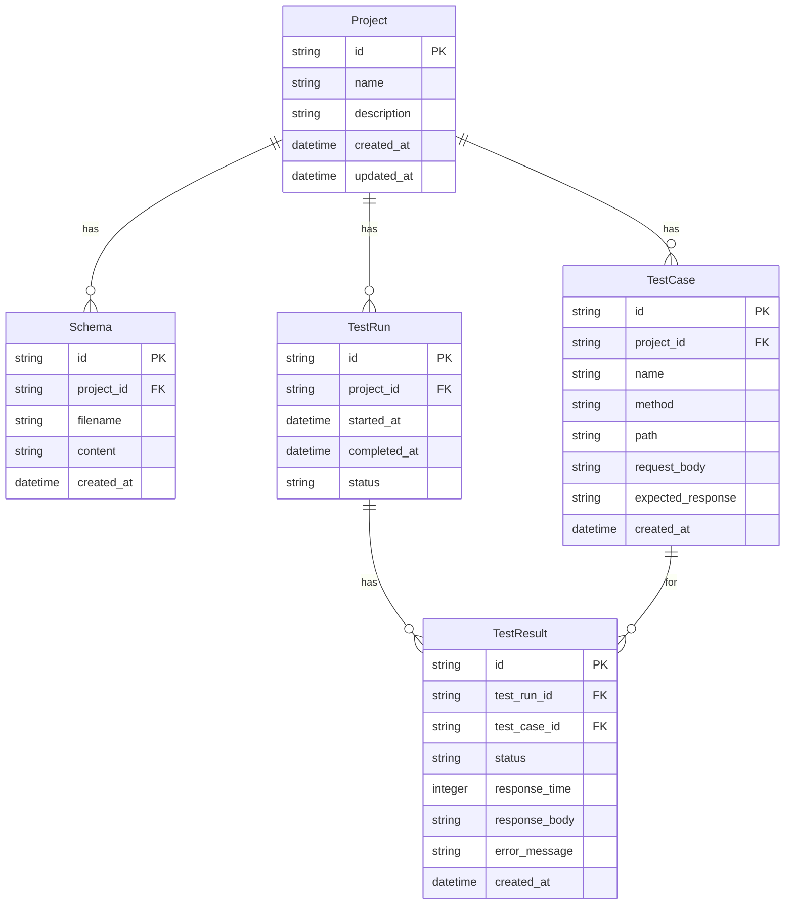

# Caseforge Architecture

**Caseforge** は OpenAPI スキーマに基づく AI テストケースの生成・実行・可視化を行う OSS ツールです。  
コンテナ化された Frontend + Backend 構成で、`git clone` → `docker compose up` によりすぐに起動可能です。

---

## ディレクトリ構成

```
caseforge/
├── backend/
│   ├── app/
│   │   ├── api/           # FastAPI ルーター
│   │   ├── config.py      # 環境変数・設定管理
│   │   ├── logging_config.py # ロギング設定
│   │   ├── models/        # SQLModel データモデル定義
│   │   ├── schemas/       # Pydantic スキーマ
│   │   ├── services/      # ドメインロジック（RAG, Schemaパース, テスト生成・実行）
│   │   ├── workers/       # Celery タスク定義
│   │   └── main.py        # FastAPI エントリーポイント
│   ├── tests/             # テストコード（単体・統合テスト）
│   │   ├── unit/          # 単体テスト
│   │   └── integration/   # 統合テスト
│   └── requirements.txt   # Python 依存パッケージ定義
│
├── frontend/
│   └── src/app/           # Next.js App Router ベースの UI
│       ├── components/    # コンポーネント（UI, atoms, molecules, organisms）
│       ├── hooks/         # カスタムフック（データフェッチング等）
│       ├── lib/           # ユーティリティ関数
│       └── projects/[id]/ # プロジェクト関連ページ（テスト生成・実行等）
│
├── docker-compose.yml     # backend, frontend, redis, chroma, db を含む開発用サービス定義
└── .env.example           # 環境変数テンプレート
```

---

## 使用技術

| レイヤ | 技術 |
|--------|------|
| フロントエンド | Next.js (App Router) / Tailwind CSS / SWR / Recharts / shadcn/ui / Zod / React Hook Form |
| バックエンド | FastAPI / Celery / LangChain (RAG) / ChromaDB / SQLModel / Pydantic Settings |
| インフラ | Docker Compose / Redis (Broker) / PostgreSQL |
| テスト | Pytest / Pytest-asyncio |

---

## システム構成図（Mermaid）



---

## 動作フロー概要

1. ユーザーが OpenAPI schema をアップロード
2. スキーマをデータベースに保存し、LangChain を通じてベクトル化して Chroma に保存（RAGの準備）
3. ユーザーが「テスト生成」を指示 → Celery 経由で非同期タスクを実行
4. LLM を用いた RAG によりテストケースを生成し、データベースに保存
5. テスト実行時、データベースからテストケースを読み込んで各 API を叩き、レスポンスを評価
6. 実行結果をデータベースに保存し、UI 上で以下を可視化：
    - 実行結果の一覧・詳細
    - ステータス別フィルター
    - グラフ（成功率・応答時間など）

### テスト生成詳細フロー



---

## 拡張設計ポイント

- **LLM**：Claude / GPT / HuggingFace など、API呼び出し部分は差し替え可能
- **RAG**：LangChain 使用。必要に応じて chunker / retriever のカスタムも容易
- **テスト形式**：生成結果は JSON 形式で保存されるため、`pytest` や `Postman` 等と連携可能
- **UI層**：API ファースト設計。将来的に GraphQL や gRPC への置換も視野
- **環境変数管理**：Pydantic Settings を使用した型安全な設定管理
- **エラーハンドリング**：構造化された例外処理と詳細なロギング
- **データベース**：SQLModel による型安全なORM、マイグレーション対応
- **フロントエンド**：
  - ダークモード対応（next-themes）
  - レスポンシブデザイン
  - パフォーマンス最適化（React.memo, useMemo, 動的インポート）

---

## データモデル構造



---

## サンプルテストケース構造（JSON形式）

```json
[
  {
    "name": "正常ログインができる",
    "method": "POST",
    "path": "/login",
    "request": {
      "headers": { "Content-Type": "application/json" },
      "body": { "email": "user@example.com", "password": "secure123" }
    },
    "expected_response": {
      "status": 200,
      "body_contains": ["token"]
    }
  },
  ...
]
```

---

## 開発ステップ（ローカル起動）

```bash
git clone https://github.com/yourname/caseforge.git
cd caseforge
cp .env.example .env
docker compose up --build
```

起動後、`http://localhost:3000` にアクセスして UI を確認できます。

---

## テスト実行方法

バックエンドのテストは以下のコマンドで実行できます：

```bash
cd backend
python -m pytest
```

特定のテストだけを実行したい場合：

```bash
# サービス層のテストのみ実行
python -m pytest tests/unit/services/

# 特定のテストファイルを実行
python -m pytest tests/unit/api/test_projects.py
```

---

> Caseforge は、開発者・QA エンジニア・SRE 向けに「AIでQAを加速する」ためのフルスタックOSS基盤です。
> フィードバック・Issue・PR 大歓迎です！