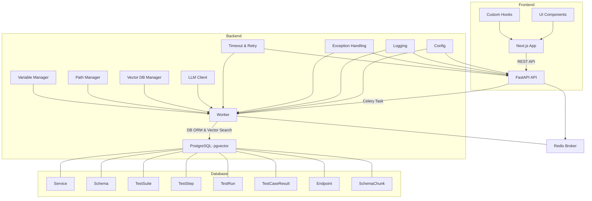
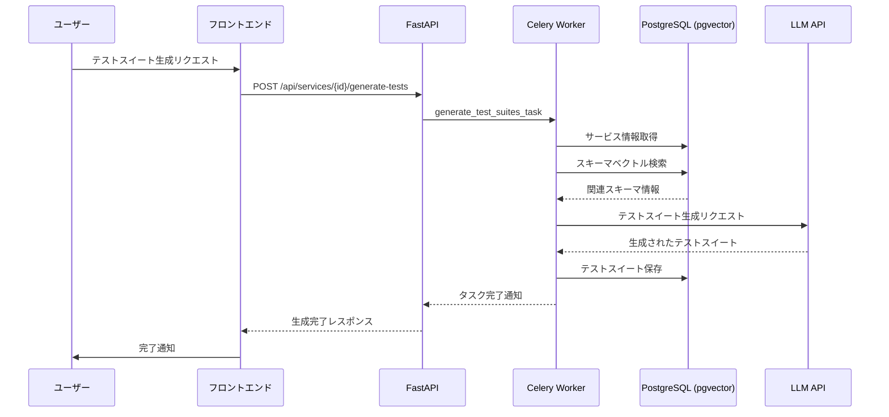
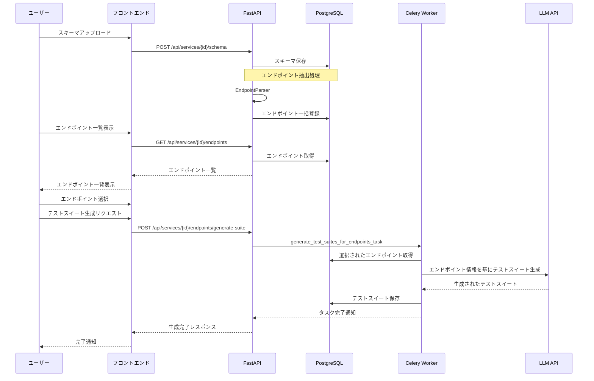
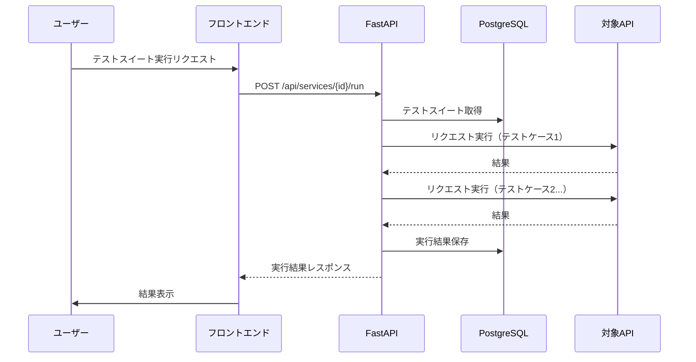
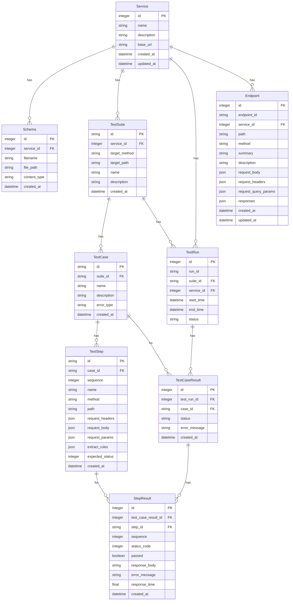

# Caseforge Architecture

**Caseforge** は OpenAPI スキーマに基づく AI テストケースの生成・実行・可視化を行う OSS ツールです。  
コンテナ化された Frontend + Backend 構成で、`git clone` → `docker compose up` によりすぐに起動可能です。

---

## ディレクトリ構成

```
caseforge/
├── backend/
│   ├── app/
│   │   ├── api/           # FastAPI ルーター
│   │   ├── config.py      # 環境変数・設定管理
│   │   ├── exceptions.py  # 例外クラス階層
│   │   ├── logging_config.py # ロギング設定
│   │   ├── models/        # SQLModel データモデル定義
│   │   │   ├── base.py    # 基本モデル
│   │   │   ├── service.py # サービス関連モデル
│   │   │   ├── endpoint.py # エンドポイント関連モデル
│   │   │   └── test/      # テスト関連モデル
│   │   │       ├── suite.py # テストスイートモデル
│   │   │       ├── case.py # テストケースモデル
│   │   │       ├── step.py # テストステップモデル
│   │   │       └── result.py # テスト結果モデル
│   │   ├── schemas/       # Pydantic スキーマ
│   │   ├── services/      # ドメインロジック
│   │   │   ├── llm/       # LLM関連
│   │   │   │   ├── client.py # LLMクライアント
│   │   │   │   └── prompts.py # プロンプト管理
│   │   │   ├── openapi/   # OpenAPI関連
│   │   │   │   ├── parser.py # スキーマパーサー
│   │   │   │   └── analyzer.py # スキーマ解析
│   │   │   ├── rag/       # RAG関連
│   │   │   │   ├── embeddings.py # 埋め込み処理
│   │   │   │   ├── chunker.py # チャンカー
│   │   │   │   └── indexer.py # インデクサー
│   │   │   ├── test/      # テスト生成・実行関連
│   │   │   │   ├── test_runner.py # テスト実行
│   │   │   │   └── variable_manager.py # 変数管理
│   │   │   └── vector_db/ # ベクトルDB関連
│   │   │       ├── embeddings.py # 埋め込みモデル
│   │   │       └── manager.py # ベクトルDB管理
│   │   ├── utils/         # ユーティリティ
│   │   │   ├── path_manager.py # パス管理
│   │   │   ├── retry.py   # リトライ機構
│   │   │   └── timeout.py # タイムアウト処理
│   │   ├── workers/       # Celery タスク定義
│   │   └── main.py        # FastAPI エントリーポイント
│   ├── tests/             # テストコード（単体・統合テスト）
│   │   ├── unit/          # 単体テスト
│   │   └── integration/   # 統合テスト
│   └── requirements.txt   # Python 依存パッケージ定義
│
├── frontend/
│   └── src/app/           # Next.js App Router ベースの UI
│       ├── components/    # コンポーネント（UI, atoms, molecules, organisms）
│       ├── hooks/         # カスタムフック（データフェッチング等）
│       ├── lib/           # ユーティリティ関数
│       └── services/[id]/ # サービス関連ページ（テスト生成・実行等）
│
├── docker-compose.yml     # backend, frontend, redis, db を含む開発用サービス定義
└── .env.example           # 環境変数テンプレート
```

---

## 使用技術

| レイヤ | 技術 |
|--------|------|
| フロントエンド | Next.js (App Router) / Tailwind CSS / SWR / Recharts / shadcn/ui / Zod / React Hook Form |
| バックエンド | FastAPI / Celery / LangChain Core / LangChain OpenAI / LangChain Community / SQLModel / Pydantic V2 / Pydantic Settings |
| インフラ | Docker Compose / Redis (Broker) / PostgreSQL |
| テスト | Pytest / Pytest-asyncio |
| 堅牢性 | 構造化例外処理 / タイムアウト処理 / リトライ機構 |

---

## システム構成図（Mermaid）



---

## 動作フロー概要

1. ユーザーが OpenAPI schema をアップロード
2. スキーマをデータベースに保存し、LangChain を通じてベクトル化してPostgreSQL (pgvector) に保存（RAGの準備）
3. ユーザーが「テストチェーン生成」を指示 → Celery 経由で非同期タスクを実行
4. LLM を用いた RAG によりテストチェーンを生成し、データベースに保存
5. テスト実行時、データベースからテストチェーンを読み込んで各 API を叩き、レスポンスを評価
6. 実行結果をデータベースに保存し、UI 上で以下を可視化：
    - 実行結果の一覧・詳細
    - ステータス別フィルター
    - グラフ（成功率・応答時間など）

### テストスイート生成詳細フロー



### エンドポイント単位のテストスイート生成フロー



### テストスイート実行フロー



---

## エンドポイント単位のテストスイート生成

Caseforgeは、OpenAPIスキーマ全体からテストチェーンを生成する機能に加えて、エンドポイント単位でテストチェーンを生成する機能を提供します。この機能により、ユーザーは特定のエンドポイントに焦点を当てたテストを効率的に作成できます。

### 1. 機能概要

- OpenAPIスキーマからエンドポイント情報を抽出し、データベースに保存
- ユーザーがUI上で特定のエンドポイントを選択可能
- 選択したエンドポイントに対してテストスイートを生成
- 生成されたテストスイートはスキーマ全体から生成したものと同様に実行可能

### 2. 技術的実装詳細

#### 2.1 エンドポイントパーサー（EndpointParser）

EndpointParserは、OpenAPIスキーマからエンドポイント情報を抽出するクラスです。主な機能は以下の通りです：

- **スキーマ解析**: YAMLまたはJSONフォーマットのOpenAPIスキーマを解析
- **$ref解決**: スキーマ内の参照（$ref）を再帰的に解決し、完全なスキーマ構造を構築
  ```python
  def _resolve_references(self, schema: Dict) -> Dict:
      # $refがあれば解決を試みる
      if "$ref" in resolved:
          ref_path = resolved["$ref"]
          if ref_path.startswith("#/"):
              parts = ref_path.lstrip("#/").split("/")
              ref_value = self.schema
              
              for part in parts:
                  if part in ref_value:
                      ref_value = ref_value[part]
              
              # $refを解決した値で置き換え
              del resolved["$ref"]
              resolved.update(copy.deepcopy(ref_value))
              
              # 解決した結果にさらに$refがある可能性があるので再帰的に解決
              resolved = self._resolve_references(resolved)
  ```
- **パラメータ抽出**: リクエストボディ、ヘッダー、クエリパラメータ、レスポンスなどの情報を抽出
- **エンドポイント情報の構造化**: 抽出した情報をEndpointモデルに適した形式に変換

#### 2.2 エンドポイントチェーン生成器（EndpointChainGenerator）

EndpointChainGeneratorは、選択されたエンドポイントからテストスイートを生成するクラスです：

- **コンテキスト構築**: 選択されたエンドポイント情報からLLMのためのコンテキストを構築
  ```python
  def _build_context(self) -> str:
      context_parts = []
      
      for endpoint in self.endpoints:
          # エンドポイントの情報を整形
          endpoint_info = f"Endpoint: {endpoint.method} {endpoint.path}\n"
          
          if endpoint.summary:
              endpoint_info += f"Summary: {endpoint.summary}\n"
          
          # リクエストボディ、ヘッダー、クエリパラメータ、レスポンス情報を追加
          # ...
          
          context_parts.append(endpoint_info)
      
      return "\n\n".join(context_parts)
  ```

- **LLMプロンプト設計**: エンドポイント情報を基にテストスイートを生成するためのプロンプトを設計
  ```python
  prompt = ChatPromptTemplate.from_template(
      """You are an API testing expert. Using the following OpenAPI endpoints:
  {context}
  
  Generate a test suite that tests these endpoints. The test suite should contain multiple test cases, including normal and abnormal cases.
  For example, if a POST creates a resource and returns an ID, use that ID in subsequent requests.
  
  Return ONLY a JSON object with the following structure:
  {{
    "name": "Descriptive name for the chain",
    "steps": [
      {{
        "method": "HTTP method (GET, POST, PUT, DELETE)",
        "path": "API path with placeholders for parameters",
        "request": {{
          "headers": {{"header-name": "value"}},
          "body": {{"key": "value"}}
        }},
        "response": {{
          "extract": {{"variable_name": "$.jsonpath.to.value"}}
        }}
      }}
    ]
  }}
  """
  )
  ```

- **テストスイート生成**: LLMを呼び出してテストスイートを生成し、JSONとして解析
- **エラーハンドリング**: LLMレスポンスのパース失敗や呼び出しエラーに対する堅牢な処理

#### 2.3 フロントエンドインターフェース

エンドポイント管理のためのUIコンポーネントが実装されています：

- **エンドポイント一覧表示**: メソッド、パス、概要などの情報を表形式で表示
- **検索フィルタリング**: エンドポイントをパスやメソッドで検索可能
- **エンドポイント選択**: チェックボックスによる複数選択
- **詳細表示**: サイドパネルでエンドポイントの詳細情報（リクエストボディ、ヘッダー、クエリパラメータ、レスポンスなど）を表示
- **テストスイート生成**: 選択したエンドポイントからテストスイートを生成するボタン

### 3. 利点

- **選択的テストスイート生成**: 全スキーマではなく、特定のエンドポイントに焦点を当てたテストスイートを生成可能
- **詳細な情報提供**: エンドポイントの詳細情報をUI上で確認可能
- **効率的なテスト作成**: 関連するエンドポイントを選択してテストスイートを生成することで、テストの網羅性と効率性を向上
- **柔軟なテスト戦略**: 全体テストと特定機能テストを組み合わせた柔軟なテスト戦略の実現

---

## 拡張設計ポイント

- **LLM**：抽象化されたLLMクライアントにより、Claude / GPT / HuggingFace など、API呼び出し部分は差し替え可能
- **RAG**：モジュール化されたRAG実装。chunker / embeddings / indexer のカスタムも容易
- **ベクトルDB**：抽象化されたベクトルDBマネージャーにより、PostgreSQL (pgvector) など異なるベクトルDBを柔軟に切り替え可能
- **テスト形式**：生成結果は JSON 形式で保存されるため、`pytest` や `Postman` 等と連携可能
- **UI層**：API ファースト設計。将来的に GraphQL や gRPC への置換も視野
- **環境変数管理**：Pydantic V2 Settings を使用した型安全な設定管理
- **エラーハンドリング**：階層化された例外クラスと構造化された例外処理
- **堅牢性**：タイムアウト処理とリトライ機構による安定した実行
- **データベース**：SQLModel による型安全なORM、マイグレーション対応
- **デバッグ**：debugpy によるリモートデバッグ対応
- **エンドポイント管理**：OpenAPIスキーマからエンドポイント情報を抽出し、個別または選択的にテストチェーンを生成可能
- **フロントエンド**：
  - ダークモード対応（next-themes）
  - レスポンシブデザイン
  - パフォーマンス最適化（React.memo, useMemo, 動的インポート）

---

## データモデル構造



---

## テストスイート構造（JSON形式）

```json
{
  "name": "ユーザー作成と取得",
  "test_cases": [
    {
      "case_id": "case-1",
      "name": "正常系",
      "description": "正常なユーザー作成と取得",
      "error_type": null,
      "steps": [
        {
          "sequence": 0,
          "method": "POST",
          "path": "/users",
          "request": {
            "headers": { "Content-Type": "application/json" },
            "body": { "name": "Test User", "email": "test@example.com" }
          },
          "extract_rules": { "user_id": "$.id" },
          "expected_status": 201
        },
        {
          "sequence": 1,
          "method": "GET",
          "path": "/users/{user_id}",
          "request": {},
          "expected_status": 200
        }
      ]
    }
  ]
}
```

---

## 依存関係を考慮したテストスイート生成

Caseforgeは、OpenAPIスキーマから依存関係を考慮したテストチェーンを自動生成します。

1. **依存関係の抽出**：OpenAPIスキーマを解析し、エンドポイント間の依存関係を特定
   - パスパラメータの依存関係（例：`POST /users` → `GET /users/{id}`）
   - リソース操作の依存関係（例：作成→取得→更新→削除）

2. **テストスイート候補の特定**：依存関係グラフから有望なテストスイート候補を特定
   - 依存関係のないエンドポイントからスタート
   - 最長のパスを優先的に選択

3. **RAGによるテストスイート生成**：LLMを使用して各テストスイート候補に対するテストスイートを生成
   - リクエストボディの生成
   - レスポンスからの変数抽出ルールの設定
   - 後続リクエストでの変数利用

---

## 例外処理アーキテクチャ

Caseforgeは、階層化された例外クラスを提供し、一貫したエラーハンドリングを実現します。各例外クラスには適切なエラーコードが割り当てられ、エラーの種類を明確に区別できます。

```mermaid
graph TD;
  A[CaseforgeException] --> B1[SystemException]
  A --> B2[LLMException]
  A --> B3[TestException]
  A --> B4[APIException]
  A --> B5[DataException]
  
  B1 --> C1[ConfigurationException]
  B1 --> C2[TimeoutException]
  B1 --> C3[ResourceException]
  
  B2 --> C4[PromptException]
  B2 --> C5[ModelCallException]
  B2 --> C6[RAGException]
  
  B3 --> C7[TestGenerationException]
  B3 --> C8[TestExecutionException]
  B3 --> C9[TestValidationException]
  
  B4 --> C10[OpenAPIParseException]
  B4 --> C11[EndpointException]
  B4 --> C12[RequestException]
  B4 --> C13[ResponseException]
  
  B5 --> C14[DatabaseException]
  B5 --> C15[ValidationException]
  B5 --> C16[SerializationException]
```



例外処理のヘルパー関数も提供されており、例外のキャッチと処理を簡単に行えます：

```python
@handle_exceptions(fallback_value=None, reraise=False, log_level=logging.ERROR)
def process_data(data):
    # 処理中に例外が発生する可能性がある処理
    pass

@convert_exception(DatabaseException, message="データベース操作に失敗しました")
def query_database():
    # 一般的な例外をDatabaseExceptionに変換
    pass
```

---

## タイムアウト処理とリトライ機構

Caseforgeは、同期・非同期関数の実行にタイムアウト機能とリトライ機能を提供します。

### タイムアウト処理

- デコレータベースの簡単な使用法
- 同期・非同期関数の両方に対応
- 設定から柔軟にタイムアウト値を取得

```python
@timeout(timeout_key="LLM_CALL")
def call_llm(prompt):
    # LLM呼び出し処理
    pass

@async_timeout(timeout_key="DB_QUERY")
async def query_database():
    # データベースクエリ処理
    pass
```

### リトライ機構

- 複数のリトライ戦略（一定間隔、線形増加、指数関数的増加）
- ジッター（ランダム性）によるサーバー負荷の分散
- 特定の例外クラスに対するリトライ設定

```python
@retry(retry_key="API_CALL")
def call_external_api():
    # 外部API呼び出し処理
    pass

@async_retry(
    max_retries=5,
    retry_delay=1.0,
    backoff_factor=2.0,
    retry_exceptions=[ConnectionError, TimeoutError]
)
async def unstable_operation():
    # 不安定な操作
    pass
```

---

## LLMクライアントとプロンプト管理

Caseforgeは、異なるLLMプロバイダーに対して統一的なインターフェースを提供します。

### LLMクライアント

- 抽象化されたインターフェースによる複数のLLMプロバイダー対応（OpenAI, Anthropic, ローカルモデル）
- 同期・非同期呼び出しの両方に対応
- タイムアウト処理とリトライ機構の組み込み
- JSONレスポンスの自動パース

```python
# OpenAI GPTモデルの使用
client = LLMClientFactory.create(LLMProviderType.OPENAI, model_name="gpt-4")

# Anthropic Claudeモデルの使用
client = LLMClientFactory.create(LLMProviderType.ANTHROPIC, model_name="claude-3-opus-20240229")

# 同期呼び出し
response = client.call([
    Message(MessageRole.SYSTEM, "You are a helpful assistant."),
    Message(MessageRole.USER, "What is the capital of France?")
])

# 非同期呼び出し
response = await client.acall([
    Message(MessageRole.SYSTEM, "You are a helpful assistant."),
    Message(MessageRole.USER, "What is the capital of France?")
])
```

### プロンプト管理

- テンプレート化されたプロンプト
- 変数の埋め込み
- 再利用可能なプロンプトコンポーネント

---

## ベクトルDB管理

Caseforgeは、異なるベクトルデータベースに対して統一的なインターフェースを提供します。

### ベクトルDBマネージャー

- 抽象化されたインターフェースによるベクトルDB対応（PostgreSQL (pgvector)）
- 同期・非同期操作の両方に対応
- タイムアウト処理とリトライ機構の組み込み
- キャッシュ機能によるパフォーマンス最適化

```python
# PostgreSQL (pgvector) ベクトルDBの使用
# データベース接続は SQLModel で一元管理されるため、ここではマネージャーの取得のみ
vector_db_manager = VectorDBManagerFactory.create("pgvector")

# ドキュメントの追加 (SchemaChunk モデルを使用)
# documents は SchemaChunk のリストを想定
vector_db_manager.add_documents(documents)

# 類似度検索 (クエリと類似度閾値を指定)
results = vector_db_manager.similarity_search("What is the capital of France?", k=5, threshold=0.8)

# 非同期での類似度検索
results = await vector_db_manager.asimilarity_search("What is the capital of France?", k=5, threshold=0.8)
```

---

## 開発ステップ（ローカル起動）

```bash
git clone https://github.com/yourname/caseforge.git
cd caseforge
cp .env.example .env
docker compose up --build
```

起動後、`http://localhost:3000` にアクセスして UI を確認できます。

---

## テスト実行方法

バックエンドのテストは以下のコマンドで実行できます：

```bash
cd backend
python -m pytest
```

特定のテストだけを実行したい場合：

```bash
# サービス層のテストのみ実行
python -m pytest tests/unit/services/

# 特定のテストファイルを実行
python -m pytest tests/unit/api/test_services.py
```
