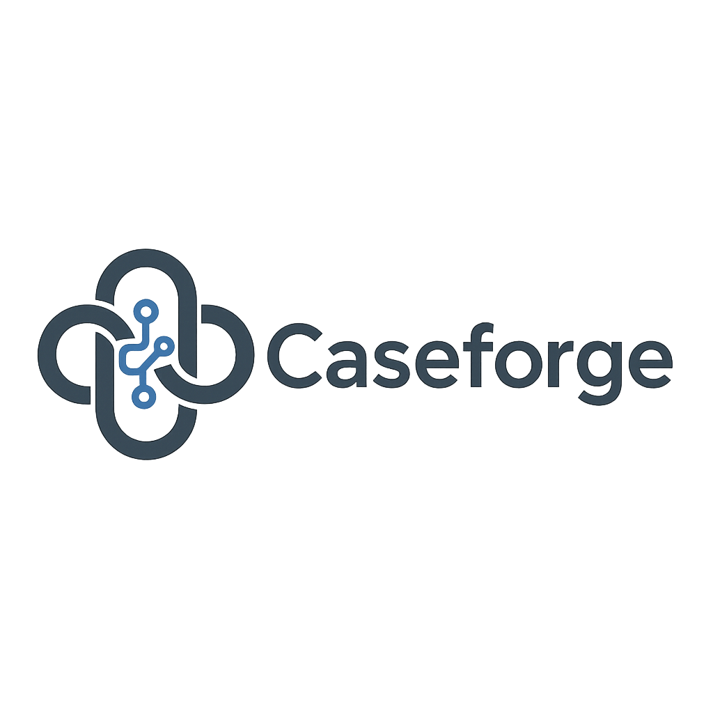

<p align="center">
  
</p>

Caseforge automatically generates and executes AI-driven request chain test scenarios from OpenAPI specifications, taking inter-endpoint dependencies into account. It provides a user-friendly interface to manage services, generate test suites, run tests, and visualize results.

## ✨ Features

- **AI-Powered Test Generation**: Automatically create comprehensive test suites from OpenAPI specs using Large Language Models (LLMs).
- **Request Chain Testing**: Generate test scenarios that chain multiple API requests, considering dependencies between endpoints.
- **OpenAPI Schema Parsing**: Ingest and parse OpenAPI specifications (YAML/JSON).
- **Test Execution**: Run generated test suites against your target API.
- **Results Visualization**: View test run results, status codes, response times, and success rates through a web UI.
- **Extensible Architecture**: Easily integrate different LLM providers, Vector Databases, and customize RAG components.

## 💡 Core Functionality

Caseforge's core functionality revolves around leveraging AI to automate API testing based on OpenAPI specifications.

1.  **Schema Upload & Processing**: Users upload an OpenAPI schema. The backend parses the schema, extracts endpoint information, and stores it in the database. Relevant parts of the schema are also processed and stored in a Vector Database using RAG (Retrieval Augmented Generation) techniques to provide context for the LLM.
2.  **Test Suite Generation**: Upon user request, a Celery worker task is triggered. This task uses the LLM client, augmented by the schema information retrieved from the Vector Database, to generate a test suite in a structured JSON format. The generated test suite includes multiple test cases and steps, potentially chaining requests based on inferred dependencies.
3.  **Test Execution**: When a user initiates a test run, the backend retrieves the specified test suite from the database. It then iterates through the test cases and steps, executing the defined API requests against the target service. The execution handles variable extraction from responses to be used in subsequent requests within a test case.
4.  **Results Reporting**: After execution, the results (status codes, response bodies, response times, pass/fail status) are stored in the database. The frontend retrieves these results and presents them to the user through various visualizations and detailed reports.

This process allows for the automated creation of sophisticated test scenarios that go beyond simple single-endpoint tests, enabling more thorough API validation.

## 🛠️ Technologies Used

- **Frontend**: Next.js (App Router), Tailwind CSS, SWR, Recharts, shadcn/ui, Zod, React Hook Form
- **Backend**: FastAPI, Celery, LangChain Core/Community/OpenAI, PostgreSQL (pgvector), SQLModel, Pydantic V2/Settings
- **Infrastructure**: Docker Compose, Redis (Broker), PostgreSQL
- **Testing**: Pytest, Pytest-asyncio
- **Robustness**: Structured Exception Handling, Timeout Handling, Retry Mechanism

## 🚀 Quick start

To get started with Caseforge, follow these steps:

1.  Clone the repository:
    ```bash
    git clone https://github.com/Pirikara/caseforge.git
    cd caseforge
    ```
2.  Copy the example environment file:
    ```bash
    cp .env.example .env
    ```
3.  Build and run the Docker containers:
    ```bash
    docker compose -f docker-compose.dev.yml up --build
    ```
    This will start the backend, frontend, database, Redis, and vector database services.
4.  Access the UI: Open your browser and go to `http://localhost:3000`.

## ⚙️ Environment Configuration

Caseforge uses `config.yaml` and environment variables (`.env` file) for configuration.

### LLM Provider Settings

By default, Caseforge is configured to use a local LLM served via an OpenAI-compatible API (like LM Studio). You can change the LLM provider and settings in the `config.yaml` file, specifically in the `llm` section.

Here's the relevant part of `config.yaml`:

```yaml
llm:
  model_name: Hermes-3-Llama-3.1-8B # Model name (used by some providers)
  openai_api_base: http://192.168.2.101:1234/v1 # Base URL for OpenAI-compatible APIs
  openai_api_key: not-needed # API Key for OpenAI-compatible APIs (often not needed for local)
  provider: openai # 'openai' or 'anthropic'
  anthropic_api_key: "" # API Key for Anthropic
  anthropic_model_name: claude-3-opus-20240229 # Model name for Anthropic
```

To switch to a different provider:

-   **Using OpenAI API**:
    1.  Set `provider: openai`.
    2.  Set `openai_api_base` to the official OpenAI API endpoint (e.g., `https://api.openai.com/v1`).
    3.  Provide your OpenAI API key. You can either set `openai_api_key` directly in `config.yaml` (not recommended for secrets) or, preferably, set the `OPENAI_API_KEY` environment variable in your `.env` file. Environment variables take precedence over `config.yaml` settings.
-   **Using Anthropic API**:
    1.  Set `provider: anthropic`.
    2.  Provide your Anthropic API key. You can either set `anthropic_api_key` directly in `config.yaml` or, preferably, set the `ANTHROPIC_API_KEY` environment variable in your `.env` file.
    3.  Optionally, update `anthropic_model_name` to the desired model (e.g., `claude-3-sonnet-20240229`).

Remember to restart your Docker containers (`docker compose -f docker-compose.dev.yml down` then `docker compose -f docker-compose.dev.yml up --build`) after changing `config.yaml` or `.env` to apply the new settings.

### Other Settings

The `config.yaml` file contains other settings like database connection, Redis URL, timeouts, and file paths. Adjust these as needed for your environment.

## 💻 Development Setup

For local development:

1.  Follow the Quick Start steps.
2.  Backend code is in the `backend/` directory. Frontend code is in the `frontend/` directory.
3.  Changes to the code will trigger hot-reloads in the respective containers (configured in `docker-compose.dev.yml`).
4.  Enable the `vector` extension in the PostgreSQL database:
    ```bash
    docker compose exec db bash
    ```
    Inside the container, connect to the database and enable the extension:
    ```bash
    psql -U caseforge -d caseforge
    ```
    ```sql
    CREATE EXTENSION vector;
    \q
    ```
    Exit the container:
    ```bash
    exit
    ```

## ✅ Running Tests

To run backend tests:

1.  Ensure your Docker containers are running (`docker compose -f docker-compose.dev.yml up`).
2.  Execute tests within the backend container:
    ```bash
    docker compose exec backend pytest
    ```
    Or run a specific test file:
    ```bash
    docker compose exec backend pytest tests/unit/services/test_chain_generator.py
    ```

## 🤝 Contributing

Contributions are welcome!

## 📄 License

This project is licensed under the [MIT License](LICENSE).
