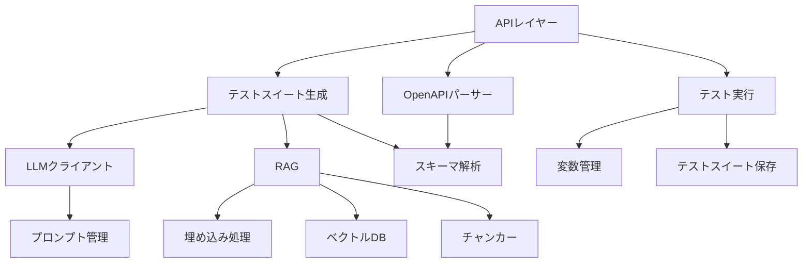

# caseforge モジュール構造

## 概要

caseforgeは、OpenAPIスキーマに基づいてAIテストケースの生成・実行・可視化を行うOSSツールです。このドキュメントでは、バックエンドのモジュール構造について説明します。

## ディレクトリ構造

```
backend/app/
├── api/                # APIルーター
├── config.py           # 設定管理
├── exceptions.py       # 例外クラス
├── logging_config.py   # ロギング設定
├── models/             # データモデル
│   ├── base.py         # 基本モデル
│   ├── project.py      # プロジェクト関連モデル
│   ├── endpoint.py     # エンドポイント関連モデル
│   └── test/           # テスト関連モデル
│       ├── suite.py    # テストスイートモデル
│       ├── case.py     # テストケースモデル
│       ├── step.py     # テストステップモデル
│       └── result.py   # テスト結果モデル
├── services/           # ドメインサービス
│   ├── openapi/        # OpenAPI関連
│   │   ├── parser.py   # スキーマパーサー
│   │   └── analyzer.py # スキーマ解析
│   ├── llm/            # LLM関連
│   │   ├── client.py   # LLMクライアント
│   │   └── prompts.py  # プロンプト管理
│   ├── rag/            # RAG関連
│   │   ├── embeddings.py # 埋め込み処理
│   │   ├── vectordb.py # ベクトルDB管理
│   │   ├── chunker.py  # チャンカー
│   │   ├── indexer.py  # インデクサー
│   │   └── dependency_aware_rag.py # 依存関係を考慮したRAG
│   └── test/           # テスト生成・実行関連
│       ├── generator.py # テストスイート生成
│       ├── endpoint_generator.py # エンドポイント単位テスト生成
│       ├── runner.py   # テスト実行
│       ├── store.py    # テストスイート保存
│       └── variable_manager.py # 変数管理
├── utils/              # ユーティリティ
│   ├── timeout.py      # タイムアウト処理
│   └── retry.py        # リトライ機構
└── workers/            # Celeryタスク
    └── tasks.py        # タスク定義
```

## 主要コンポーネント

### モデル層

モデル層は、アプリケーションのデータモデルを定義します。SQLModelを使用してデータベースとのマッピングを行います。

#### 主要なモデル

- **Project**: プロジェクト情報を管理するモデル
- **Endpoint**: APIエンドポイント情報を管理するモデル
- **TestSuite**: テストスイート（複数のテストケースをグループ化）を管理するモデル
- **TestCase**: テストケース（1つのテストパターン）を管理するモデル
- **TestStep**: テストステップ（1つのAPIリクエスト）を管理するモデル
- **TestRun**: テスト実行情報を管理するモデル
- **TestCaseResult**: テストケースの実行結果を管理するモデル
- **StepResult**: テストステップの実行結果を管理するモデル

### サービス層

サービス層は、アプリケーションのビジネスロジックを実装します。

#### OpenAPI関連

- **Parser**: OpenAPIスキーマを解析し、エンドポイント情報を抽出します
- **Analyzer**: OpenAPIスキーマから依存関係を抽出します

#### LLM関連

- **Client**: LLM APIとの通信を抽象化します
- **Prompts**: プロンプトテンプレートを管理します

#### RAG関連

- **Embeddings**: テキストの埋め込み処理を行います
- **VectorDB**: ベクトルデータベースを管理します
- **Chunker**: OpenAPIスキーマをチャンク化します
- **Indexer**: スキーマをインデックス化します
- **DependencyAwareRAG**: 依存関係を考慮したRAGを実装します

#### テスト関連

- **Generator**: テストスイートを生成します
- **EndpointGenerator**: エンドポイント単位でテストスイートを生成します
- **Runner**: テストスイートを実行します
- **Store**: テストスイートを保存・管理します
- **VariableManager**: テスト実行時の変数を管理します

### ユーティリティ

- **Timeout**: タイムアウト処理を提供します
- **Retry**: リトライ機構を提供します

### ワーカー層

- **Tasks**: Celeryタスクを定義します（非同期処理）

## 依存関係

主要なコンポーネント間の依存関係は以下の通りです：



## インターフェース

各モジュールは明確なインターフェースを提供し、内部実装の詳細を隠蔽します。主要なインターフェースは以下の通りです：

### OpenAPIパーサー

```python
def parse_schema(schema_content: str, schema_format: str) -> List[Endpoint]:
    """
    OpenAPIスキーマを解析し、エンドポイント情報を抽出する
    
    Args:
        schema_content: スキーマの内容
        schema_format: スキーマのフォーマット（"yaml" または "json"）
        
    Returns:
        抽出されたエンドポイントのリスト
    """
```

### テストスイート生成

```python
def generate_test_suites(project_id: str, error_types: Optional[List[str]] = None) -> List[Dict]:
    """
    プロジェクトのテストスイートを生成する
    
    Args:
        project_id: プロジェクトID
        error_types: 生成する異常系テストの種類リスト
        
    Returns:
        生成されたテストスイートのリスト
    """
```

### テスト実行

```python
async def run_test_suites(project_id: str, suite_id: Optional[str] = None) -> Dict:
    """
    プロジェクトのテストスイートを実行する
    
    Args:
        project_id: プロジェクトID
        suite_id: 特定のテストスイートIDを指定する場合
        
    Returns:
        実行結果
    """
```

## エラーハンドリング

アプリケーション全体で一貫したエラーハンドリングを行うために、以下の例外クラスを定義しています：

- **CaseforgeException**: 基底例外クラス
- **OpenAPIParseError**: OpenAPIスキーマのパースエラー
- **LLMError**: LLM呼び出しエラー
- **RAGError**: RAG関連エラー
- **TestGenerationError**: テスト生成エラー
- **TestRunError**: テスト実行エラー
- **TimeoutException**: タイムアウトエラー

## 設定管理

アプリケーションの設定は `config.py` で一元管理されています。環境変数から設定を読み込み、適切なデフォルト値を提供します。

## 拡張ポイント

このモジュール構造は、以下の拡張ポイントを考慮して設計されています：

1. **LLMプロバイダーの追加**: `services/llm/client.py` に新しいLLMプロバイダーを追加できます
2. **ベクトルDBの変更**: `services/rag/vectordb.py` に新しいベクトルDBを追加できます
3. **テスト生成戦略の追加**: `services/test/generator.py` に新しいテスト生成戦略を追加できます
4. **テスト実行方法の拡張**: `services/test/runner.py` に新しいテスト実行方法を追加できます